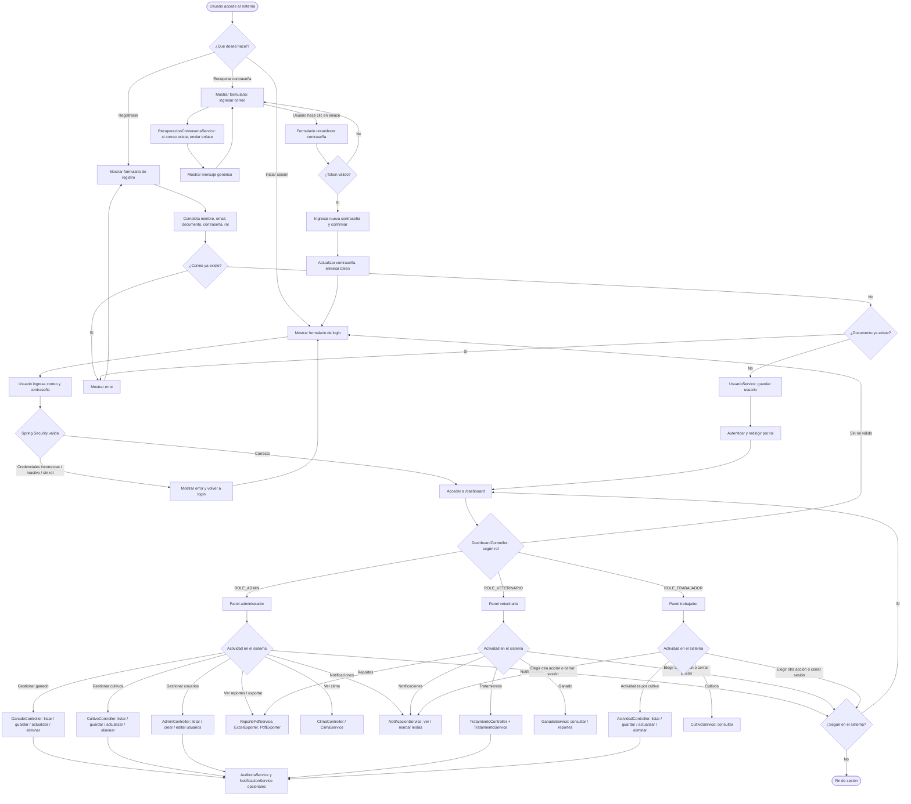

# Diagrama de actividades general - AgroSoft CRUD

Un único diagrama de actividades que resume el flujo general del proyecto: acceso, autenticación, dashboards por rol y actividades principales del sistema.

---

## Diagrama de actividades general del proyecto

---

## Leyenda rápida

| Elemento | Significado |
|----------|-------------|
| **Óvalos** `([ ])` | Inicio y fin del flujo |
| **Rectángulos** `[ ]` | Actividades (acciones del usuario o del sistema) |
| **Rombo** `{ }` | Decisión o bifurcación |
| **Flechas** `-->` | Orden del flujo; `-->\|texto\|` indica la condición del camino |

El diagrama cubre en un solo flujo: **acceso al sistema** (login, registro, recuperar contraseña), **entrada al dashboard según rol** (administrador, veterinario, trabajador) y las **actividades principales** de cada rol (CRUD de usuarios, ganado, cultivos, actividades, tratamientos, reportes, clima, notificaciones y auditoría), hasta **seguir usando el sistema o cerrar sesión**.

Puedes visualizarlo en editores con soporte Mermaid o en [mermaid.live](https://mermaid.live).
