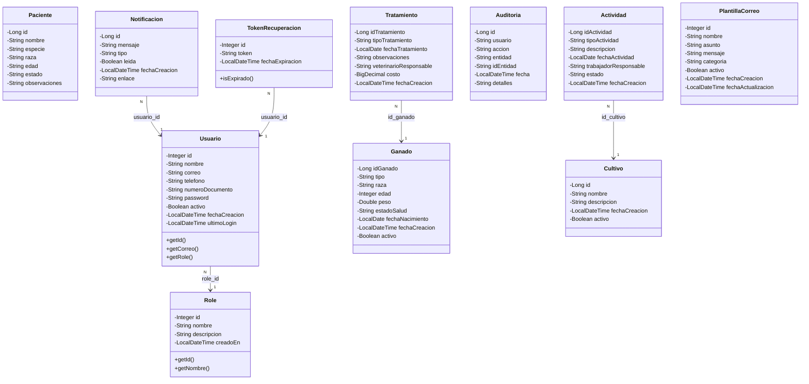
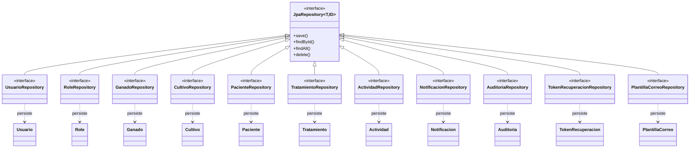
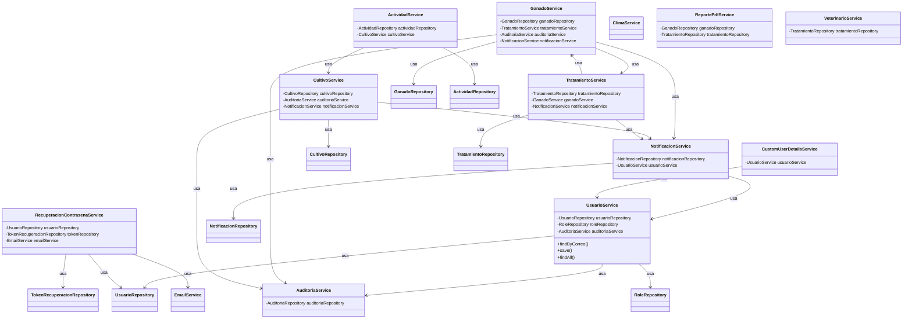
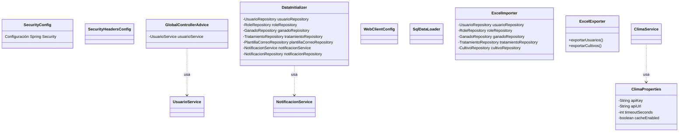

# Diagrama de clases - AgroSoft CRUD

Diagrama de clases del proyecto AgroSoft (Spring Boot): entidades, repositorios, servicios y controladores principales.

---

## 1. Entidades (modelo de dominio)

---

## 2. Repositorios (capa de datos)

---

## 3. Servicios y dependencias

---

## 4. Controladores y servicios

```mermaid
classDiagram
    class LoginController { }
    class RegistroController {
        -UsuarioService usuarioService
        -RoleRepository roleRepository
        -UserDetailsService userDetailsService
    }
    class CuentaController {
        -UsuarioService usuarioService
    }
    class AdminController {
        -UsuarioService usuarioService
        -RoleRepository roleRepository
    }
    class DashboardController {
        -UsuarioService usuarioService
        -CultivoService cultivoService
        -VeterinarioService veterinarioService
        -GanadoService ganadoService
        -ActividadService actividadService
    }
    class GanadoController {
        -GanadoService ganadoService
    }
    class CultivoController {
        -CultivoService cultivoService
    }
    class TratamientoController {
        -TratamientoService tratamientoService
        -GanadoService ganadoService
    }
    class ActividadController {
        -ActividadService actividadService
        -CultivoService cultivoService
    }
    class PacienteController {
        -PacienteRepository pacienteRepository
    }
    class RecuperarContrasenaController {
        -RecuperacionContrasenaService recuperacionService
    }
    class EmailController {
        -EmailService emailService
        -PlantillaCorreoRepository plantillaCorreoRepository
        -UsuarioRepository usuarioRepository
    }
    class ReporteController {
        -ReportePdfService reportePdfService
    }
    class ClimaController {
        -ClimaService climaService
    }
    class BusquedasController {
        -UsuarioRepository usuarioRepository
        -GanadoRepository ganadoRepository
        -CultivoRepository cultivoRepository
        -TratamientoRepository tratamientoRepository
        -ActividadRepository actividadRepository
    }
    class SessionConfigController {
        -NotificacionService notificacionService
    }

    LoginController ..> Login
    RegistroController --> UsuarioService
    CuentaController --> UsuarioService
    AdminController --> UsuarioService
    DashboardController --> UsuarioService
    DashboardController --> CultivoService
    DashboardController --> GanadoService
    DashboardController --> ActividadService
    GanadoController --> GanadoService
    CultivoController --> CultivoService
    TratamientoController --> TratamientoService
    ActividadController --> ActividadService
    RecuperarContrasenaController --> RecuperacionContrasenaService
    ReporteController --> ReportePdfService
    ClimaController --> ClimaService
    SessionConfigController --> NotificacionService
```

---

## 5. Configuración y utilidades

---

## Resumen de capas

| Capa           | Componentes principales |
|----------------|-------------------------|
| **Entidades**  | Usuario, Role, Ganado, Cultivo, Paciente, Tratamiento, Actividad, Notificacion, Auditoria, TokenRecuperacion, PlantillaCorreo |
| **Repositorios** | Uno por entidad (JpaRepository) |
| **Servicios**  | UsuarioService, GanadoService, CultivoService, TratamientoService, ActividadService, NotificacionService, AuditoriaService, RecuperacionContrasenaService, EmailService, ClimaService, ReportePdfService, VeterinarioService, CustomUserDetailsService |
| **Controladores** | Login, Registro, Cuenta, Admin, Dashboard, Ganado, Cultivo, Tratamiento, Actividad, Paciente, RecuperarContrasena, Email, Reporte, Clima, Busquedas, SessionConfig, CargaDatos, DataLoad, ViewController, VetController, TrabajadorController, CustomErrorController |
| **Config**     | SecurityConfig, SecurityHeadersConfig, GlobalControllerAdvice, DataInitializer, ClimaProperties, WebClientConfig, SqlDataLoader |
| **Util**       | ExcelImporter, ExcelExporter |

---

*Generado para el proyecto AgroSoft CRUD (Spring Boot).*
