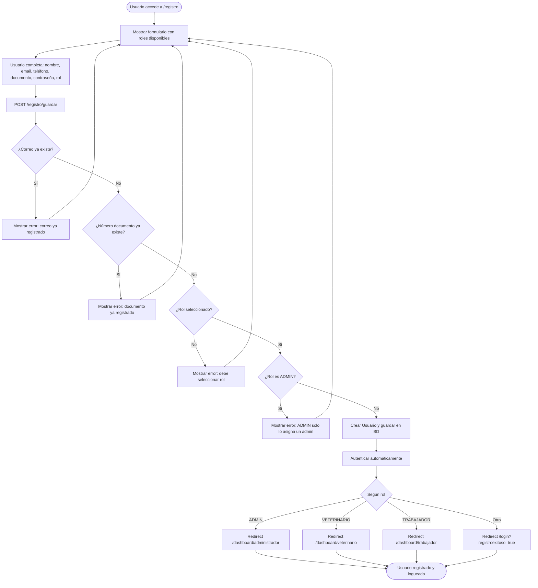
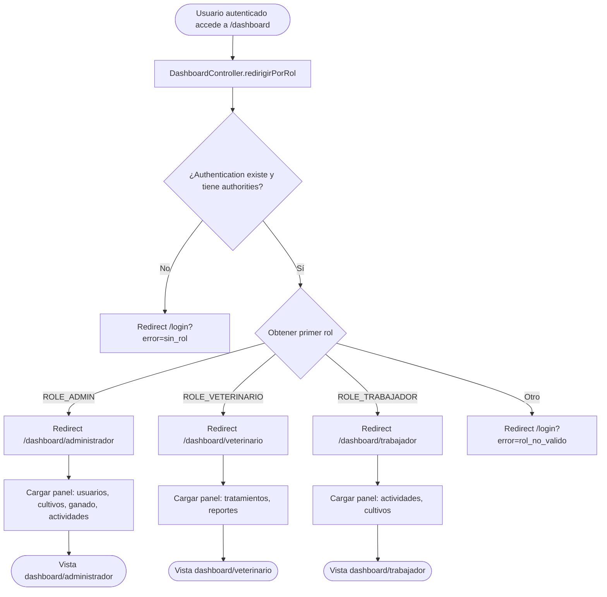
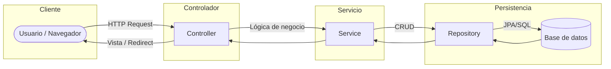
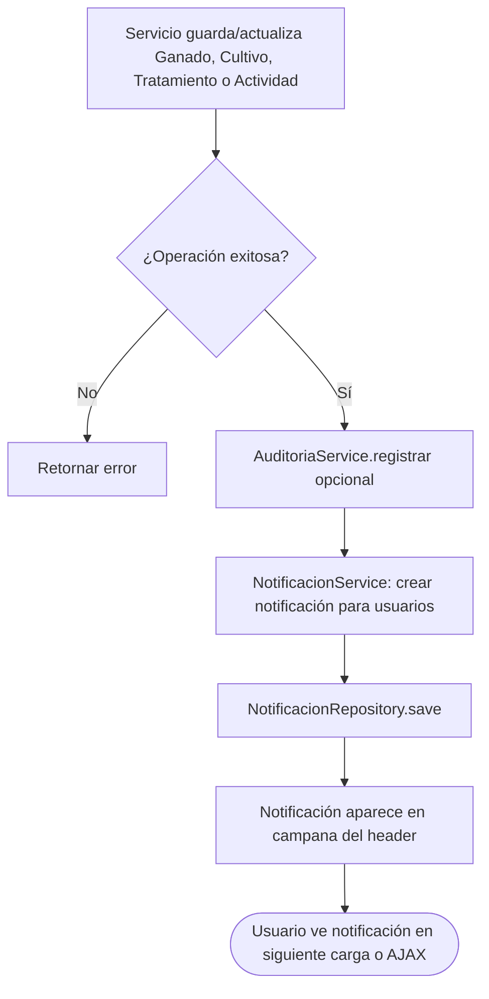

# Diagramas de flujo - AgroSoft CRUD

Flujos principales de la aplicación: login, registro, recuperación de contraseña, CRUD y acceso al dashboard.

---

## 1. Flujo de inicio de sesión (Login)

```mermaid
flowchart TD
    A([Usuario accede a /login]) --> B[Mostrar formulario login]
    B --> C[Usuario ingresa correo y contraseña]
    C --> D{Spring Security valida}
    D -->|Credenciales incorrectas| E[Redirigir /login?error=true]
    E --> B
    D -->|Usuario inactivo| F[Redirigir /login?error=inactivo]
    F --> B
    D -->|Sin rol asignado| G[Redirigir /login?error=sin_rol]
    G --> B
    D -->|Rol no válido| H[Redirigir /login?error=rol_no_valido]
    H --> B
    D -->|Credenciales correctas| I[Redirigir a /dashboard]
    I --> J{DashboardController: según rol}
    J -->|ROLE_ADMIN| K[/dashboard/administrador]
    J -->|ROLE_VETERINARIO| L[/dashboard/veterinario]
    J -->|ROLE_TRABAJADOR| M[/dashboard/trabajador]
    J -->|Otro| N[Redirigir /login?error=rol_no_valido]
    K --> O([Panel administrador])
    L --> P([Panel veterinario])
    M --> Q([Panel trabajador])
```

---

## 2. Flujo de registro de usuario



---

## 3. Flujo de recuperación de contraseña

```mermaid
flowchart TD
    subgraph Solicitud
        A([Usuario en /recuperar]) --> B[Mostrar formulario: ingresar correo]
        B --> C[POST: enviar correo]
        C --> D{¿Correo vacío?}
        D -->|Sí| E[Redirect /recuperar con error]
        E --> B
        D -->|No| F[RecuperacionContrasenaService.solicitarRecuperacion]
        F --> G{¿Correo existe en BD?}
        G -->|No| H[No revelar; mostrar mensaje genérico]
        G -->|Sí| I[Eliminar tokens anteriores del usuario]
        I --> J[Generar token y guardar TokenRecuperacion]
        J --> K[Enviar email con enlace /recuperar/restablecer?token=xxx]
        K --> L[Redirect /recuperar con mensaje: revisa tu correo]
        H --> L
    end

    subgraph Restablecer
        M([Usuario hace clic en enlace del correo]) --> N[GET /recuperar/restablecer?token=xxx]
        N --> O{¿Token válido y no expirado?}
        O -->|No| P[Mostrar formulario con mensaje: enlace inválido/expirado]
        O -->|Sí| Q[Mostrar formulario: nueva contraseña + confirmar]
        Q --> R[POST /recuperar/restablecer]
        R --> S{¿Token aún válido?}
        S -->|No| T[Redirect /recuperar con error]
        S -->|Sí| U{¿Contraseña >= 6 caracteres?}
        U -->|No| V[Error: mínimo 6 caracteres]
        V --> Q
        U -->|Sí| W{¿Contraseñas coinciden?}
        W -->|No| X[Error: contraseñas no coinciden]
        X --> Q
        W -->|Sí| Y[Actualizar password en Usuario, eliminar token]
        Y --> Z[Redirect /login con mensaje: contraseña actualizada]
        Z --> AA([Fin: usuario puede iniciar sesión])
    end
```



---

## 4. Flujo CRUD de Ganado (ejemplo)

```mermaid
flowchart TD
    subgraph Listar
        A([GET /admin/ganado]) --> B[GanadoController.listar]
        B --> C[GanadoService.listarGanado]
        C --> D[GanadoRepository.findAll]
        D --> E[Vista dashboard/ganado con lista]
    end

    subgraph Crear
        F([POST /admin/ganado/guardar]) --> G[Recibir: tipo, raza, edad, peso, estadoSalud, fechaNacimiento]
        G --> H[Crear entidad Ganado]
        H --> I[GanadoService.guardarGanado]
        I --> J[Auditoría + Notificación opcional]
        J --> K[GanadoRepository.save]
        K --> L[Redirect /admin/ganado?success=guardado]
    end

    subgraph Actualizar
        M([POST /admin/ganado/actualizar]) --> N[Recibir idGanado + campos]
        N --> O[GanadoService.obtenerGanadoPorId]
        O --> P{¿Existe?}
        P -->|No| Q[Error: ganado no encontrado]
        P -->|Sí| R[Actualizar campos y GanadoService.guardarGanado]
        R --> S[Redirect /admin/ganado?success=actualizado]
    end

    subgraph Eliminar
        T([POST /admin/ganado/eliminar o desactivar]) --> U[GanadoService: eliminar o marcar activo=false]
        U --> V[Redirect /admin/ganado?success=eliminado]
    end
```



---

## 5. Flujo de acceso al Dashboard por rol



---

## 6. Flujo general de una petición (capas)



---

## 7. Flujo de notificaciones (cuando se crea/actualiza entidad)



---

*Diagramas de flujo del proyecto AgroSoft CRUD. Puedes visualizarlos en editores con soporte Mermaid o en [mermaid.live](https://mermaid.live).*
